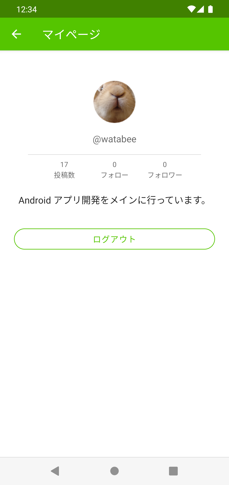
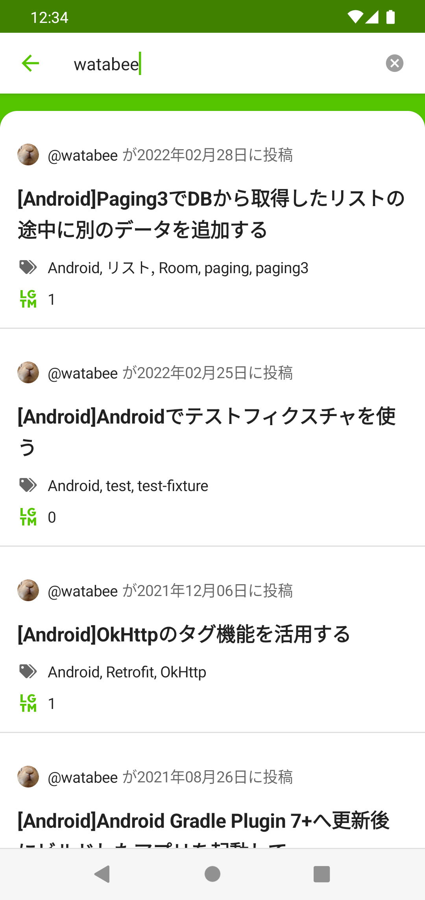
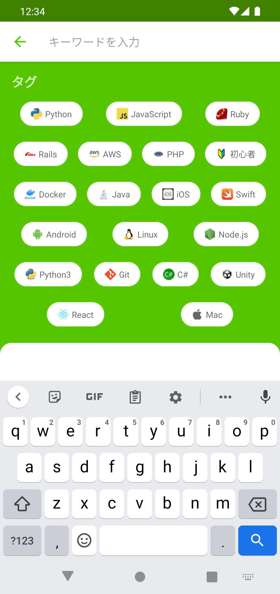

# Qiita Compose

This is a project for an unofficial [Qiita](https://qiita.com/) client application.

## Screenshots

<table>
  <tr>
    <td></td>
    <td></td>
  </tr>
  <tr>
    <td></td>
    <td></td>
  </tr>
</table>

## Setup

This project requires the following keys.

- Qiita Client ID
- Qiita Client Secret

You can get the keys in [Qiita user settings page](https://qiita.com/settings/applications).

Once you obtain the keys, you can set them in your `local.properties`:

```
QIITA_CLIENT_ID=<insert>
QIITA_CLIENT_SECRET=<insert>
```
